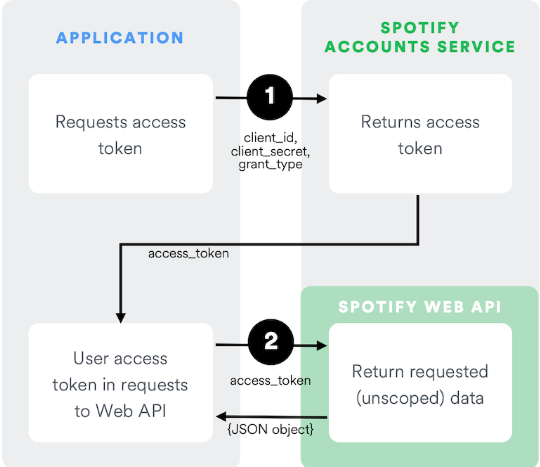

# baas-playlist
Este proyecto es un baas (backend as a service) de una lista de reproduccion que permite: 
 - crear playlist
 - obtener el listado de playlists
 - obtener la descripcion por el nombre de la playlist
 - eliminar la playlist
 - obtener un listado con los generos musicales consumidos desde la API de **Spotify**

Adicionalmente, para hacer uso de los endpoints ya mencionados, el baas cuenta con una capa de registro, autenticacion y autorizacion.

# Recursos

### - POSTMAN COLLECTIONS

Puedes encontrar la colleccion de POSTMAN [aquí](https://github.com/yipson/baas-playlist/blob/master/src/main/resources/postman/baas-playlist.postman_collection.json).

Puedes encontrar los Envs de POSTMAN [aquí](https://github.com/yipson/baas-playlist/blob/master/src/main/resources/postman/baas-playlist.postman_collection.json).

### - Spotify Authorization

